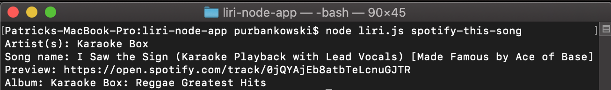
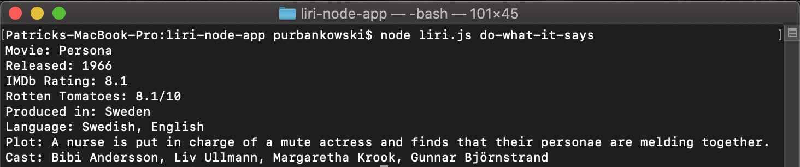

# Liri (Node App) Overview
Liri (Language Interpretation and Recognition Interface) is a command line node app that takes in parameters and gives back the user data based on the parameters.

# Application Organization

1. First, a Github repository called liri-node-app was made. In the root of the repo, the terminal/gitbash command `npm init -y` was run to initialize a `package.json` file to the project, which is required for installing third party npm packages and saving their version numbers. 

2. A `.gitignore` file was was made, which stores files in the repo that are not shared to github (to preserve security of passwords and API keys).

the following lines were added to this file:

node_nodules
.DS_Store
.env

3. Then, a JavaScript file named `keys.js` was made, which stored all the paths to the API keys and ids that were stored in a .env file.

This is the code of the keys.js file:

```js
exports.spotify = {
  id: process.env.SPOTIFY_ID,
  secret: process.env.SPOTIFY_SECRET
};

exports.bands = {
    id: process.env.BANDS_ID
}

exports.omdb = {
    key: process.env.OMDB_KEY
}
```

4. Next, a `.env` file was created with the following lines of code (your-spotify-id was replaced with the actual id (etc.)):

```js
SPOTIFY_ID=your-spotify-id
SPOTIFY_SECRET=your-spotify-secret
BANDS_ID=your-bandsintown-id
OMDB_KEY=your-omdb-key
```

Anybody wishing to clone this repo will have to create their own `.env` file with their own Spotify, Bands In Town, and OMDb API account keys.

5. For purposes of app demonstration, a file called `random.txt` was made with the following inside:

spotify-this-song,"I Want it That Way"

6. A JavaScript file called `liri.js` was made (available in this repo). Generally, code was read to set any environment variables with the dotenv package like so:

```js
require("dotenv").config();
```

7. The code required to import the `keys.js` file was generally written and stored in a variable like so.

```js
  var keys = require("./keys.js");
```
  
* 'Keys' information could be accessed like this:

  ```js
  var spotify = new Spotify(keys.spotify);
  ```

8. Liri was written so that the user could call one of the following four commands, following a prompt about which they wished to seek information:

* `concert-this`

* `spotify-this-song`

* `movie-this`

* `do-what-it-says`

# User Instructions

## concert-this (liri command)

If a user wishes to find the tour dates for a particular music artist, the user can type in terminal/gitbash (while in the root of the liri-node-app repo) `node liri.js concert-this "artist/band"` (replace artist/band with artist/band you wish to search for, also do not include outer ` `).

* This will search the Bands in Town Artist Events API (`"https://rest.bandsintown.com/artists/" + artist + "/events?app_id=" + bands.id`) for an artist and render the following information about each event to the terminal:

     * Name of the venue

     * Venue location

     * Date of the Event (used moment to format this as "MM/DD/YYYY")

### Images


## spotify-this-song (liri command)

1. If a user wishes to search for a song's artist, a link to a preview of the song, and the album on which the song appears, the user can type `node liri.js spotify-this-song "song name"`. If no song is provided, Ace of Base "The Sign" will appear as the song choice.

2. This required getting a Spotify API account to get a **client id** and **client secret**:

* Step One: Visit <https://developer.spotify.com/my-applications/#!/>

* Step Two: Either login to your existing Spotify account or create a new one (a free account is fine) and log in.

* Step Three: Once logged in, navigate to <https://developer.spotify.com/my-applications/#!/applications/create> to register a new application to be used with the Spotify API. You can fill in whatever you'd like for these fields. When finished, click the "complete" button.

* Step Four: On the next screen, scroll down to where you see your client id and client secret. Copy these values down somewhere, you'll need them to use the Spotify API and the [node-spotify-api package](https://www.npmjs.com/package/node-spotify-api).

### Images





## movie-this (liri command)

1. For this liri command, the user can find out the following information about a film by typing `node liri.js movie-this "name of movie"`:

    ```
       * Title of the movie.
       * Year the movie came out.
       * IMDB Rating of the movie.
       * Rotten Tomatoes Rating of the movie.
       * Country where the movie was produced.
       * Language of the movie.
       * Plot of the movie.
       * Actors in the movie.
     ```

     * If the user doesn't type a movie in, the program will output data for the movie 'Mr. Nobody.'

2. The`axios` package was used to retrieve data from the OMDB API. The OMDB API requires an API key.

* [Axios](https://www.npmjs.com/package/axios)

### Images


## do-what-it-says (liri command)

1. Finally, the do-what-it-says command looks at a `random.txt` file and performs whatever liri command is written in there, along with its input. 

2. Initally, what is written in the `random.txt` file is spotify-this-song,"I Want it That Way". 

3. It is the do-what-it-says command to perform the spotify-this-song command, as requested in the .txt files, on the song "I Want it That Way".

4. The `fs` Node package was used to interpret the text in the random.txt file to perform these liri commands.





# Deployed Site

https://psu23.github.io/liri-node-app/

# Technologies Used

* Node.js

* Moment.js

* Spotify node API

* fs

* dotenv

# Credits

* Patrick Urbankowski